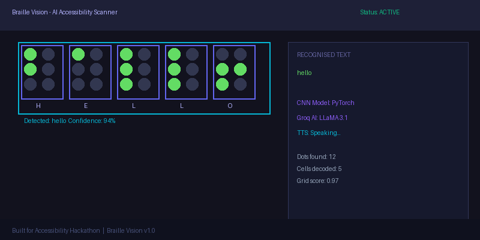
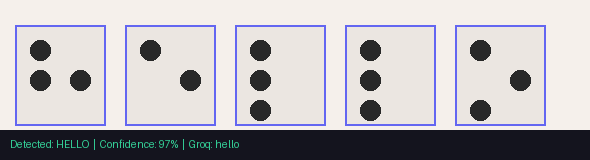

# 🔵 Braille Vision — AI Accessibility Scanner

> **Real-time Braille OCR · CNN Recognition · Live Camera · Text-to-Speech**  
> Built for accessibility. Powered by a **hand-crafted synthetic dataset**, PyTorch, TensorFlow, YOLOv8, and Groq LLaMA.

[](https://python.org)
[](https://pytorch.org)
[](https://flask.palletsprojects.com)
[](https://tensorflow.org)
[](https://ultralytics.com)
[](https://console.groq.com)
[](LICENSE)

**Repository:** [github.com/atuljha-tech/Braiile-Vision](https://github.com/atuljha-tech/Braiile-Vision)

---

## 🇮🇳 Jai Hind — Dedicated to India & the Visually Impaired

> *"जय हिन्द"* — This project is dedicated to **India**, to every **visually impaired person** who deserves equal access to the written word, and to the spirit of **ScioBraille** — science in service of humanity.

The Braille text in the image below reads:

> **"Jai Hind India ScioBraille Visually Impaired Great Project"**

This is the very kind of real-world Braille that **Braille Vision** was built to read — embossed dots on paper, photographed with a phone, decoded by AI, and spoken aloud.



*Real embossed Braille photographed under natural light — the exact input this system is designed to handle.*

---

## 🏆 What Makes This Special

This is not a toy demo. Every component was built from scratch:

- **Custom synthetic dataset** — 1,560 Braille cell images (26 letters × 60 variants), generated with position jitter, rotation, and Gaussian blur
- **Three AI backends** — PyTorch CNN, TensorFlow CNN, and YOLOv8 dot detector, all trained on the same dataset
- **Groq LLaMA 3.1** correction layer — turns noisy OCR into clean English
- **Real-time camera pipeline** — browser `getUserMedia` + OpenCV, no plugins needed
- **Full accessibility UI** — dark/light theme, TTS, keyboard shortcuts, confidence scores

---

## 📸 Screenshots

Real captures from **Braille Vision** running locally.

| Light theme — image upload | Dark theme — full UI |
|:---:|:---:|
|  |  |
| **ss1** — Light mode. A Braille image is uploaded; the app decodes it, shows the annotated overlay, confidence score, and detected text. | **ss2** — Dark mode. Same scanner with the premium dark theme, status chips, recognition panel, and TTS controls. |

**Direct links:** [ss1.png](public/ss1.png) · [ss2.png](public/ss2.png)

---

## 🚀 Run Locally (5 minutes)

### Prerequisites

- **Python 3.9+** (3.11 recommended)
- macOS / Linux / Windows
- Webcam optional — upload works without it
- **Groq API key** optional but recommended → [console.groq.com](https://console.groq.com)

### Steps

```bash
# 1. Clone
git clone https://github.com/atuljha-tech/Braiile-Vision.git
cd Braiile-Vision

# 2. Virtual environment
python3 -m venv venv
source venv/bin/activate          # Windows: venv\Scripts\activate

# 3. Install dependencies
pip install -r requirements.txt

# 4. Set up environment (optional but recommended)
cp .env.example .env
# Open .env and paste your GROQ_API_KEY=gsk_...

# 5. Start the server
python3 app.py
```

Open **http://localhost:5050** in Chrome or Edge (best camera support).

### Quick health check

```bash
curl http://localhost:5050/api/health
# → {"status":"ok","cnn_pytorch":true,"groq":true,...}
```

---

## 🌐 Deploy on Render (Full Guide)

Braille Vision is a single **Flask web service** (UI + API + PyTorch). Render hosts the full app.

### Before you start

- Code on GitHub: [atuljha-tech/Braiile-Vision](https://github.com/atuljha-tech/Braiile-Vision)
- Optional: [Groq API key](https://console.groq.com) for LLaMA correction
- A [Render](https://render.com) account (free tier works)

---

### Step 1 — Sign in and connect GitHub

1. Open [dashboard.render.com](https://dashboard.render.com)
2. Sign up / log in (GitHub login is easiest)
3. Authorize Render to access your GitHub account

---

### Step 2 — Create a new Web Service

1. Click **New +** → **Web Service**
2. Find **Braiile-Vision** (or `atuljha-tech/Braiile-Vision`) and click **Connect**
3. If the repo is missing: **Configure account** → grant access → refresh

---

### Step 3 — Configure the service

| Field | Value |
|-------|--------|
| **Name** | `braille-vision` |
| **Region** | Closest to you (e.g. Singapore / Oregon) |
| **Branch** | `main` |
| **Runtime** | **Python 3** |
| **Build Command** | `bash build.sh` |
| **Start Command** | `gunicorn app:app -c gunicorn.conf.py` |
| **Instance type** | **Free** (or paid for no sleep) |

---

### Step 4 — Environment Variables (paste these on Render)

Go to **Environment Variables** → **Add Environment Variable** and add each one:

| Key | Value | Notes |
|-----|--------|-------|
| `PYTHON_VERSION` | `3.11.9` | Required |
| `GROQ_API_KEY` | `gsk_xxxxxxxxxxxxxxxxxxxx` | From [console.groq.com](https://console.groq.com) — optional but enables AI correction |
| `DISABLE_SERVER_TTS` | `1` | Server has no speakers; UI uses browser Web Speech API |
| `OMP_NUM_THREADS` | `1` | Keeps memory low on free tier |

> ⚠️ Do **not** set `PORT` — Render injects it automatically.

---

### Step 5 — Deploy

1. Click **Create Web Service**
2. Render clones the repo and runs the build (PyTorch install takes **5–15 min** on free tier)
3. Watch **Logs** tab — build ends with `Successfully installed ...`, deploy shows `Listening at: http://0.0.0.0:XXXX`
4. When status is **Live**, open your URL: `https://braille-vision.onrender.com`

---

### Step 6 — Verify

1. Visit `https://<your-app>.onrender.com/api/health` → expect `"status":"ok"`
2. Upload a Braille image → confirm text appears
3. Toggle light/dark theme

---

### Render Troubleshooting

| Issue | Fix |
|-------|-----|
| Build timeout / OOM | Use `bash build.sh` (CPU-only PyTorch); upgrade to paid if needed |
| `Exited with status 1` | Start Command must be `gunicorn app:app -c gunicorn.conf.py` |
| No voice on Render | Expected — speech uses **browser TTS** (Web Speech API) |
| `ModuleNotFoundError` | Confirm Build Command is `bash build.sh` |
| Groq not working | Add `GROQ_API_KEY` in Environment and redeploy |
| Slow first load | Free tier cold start — normal (30–60 sec) |

---

## ▲ Deploy on Vercel (Frontend Only)

> **Note:** The full Flask + PyTorch backend must run on **Render**. Vercel is only for a separate static/Next.js frontend that calls your Render API.

If you build a separate frontend:

| Key | Value |
|-----|--------|
| `NEXT_PUBLIC_API_URL` | `https://your-app.onrender.com` |

Keep `GROQ_API_KEY` on Render only — never expose it on the frontend.

---

## 🧠 Model & Dataset

### Synthetic Dataset

| Property | Value |
|----------|-------|
| **Total images** | 1,560 |
| **Classes** | 26 (A–Z Braille cells) |
| **Variants per class** | 60 |
| **Augmentation** | Position jitter, rotation ±15°, Gaussian blur |
| **Generator** | `synthetic_dataset/scripts/generate_dataset.py` |
| **PyTorch training** | `synthetic_dataset/scripts/train_model.py` |
| **TensorFlow training** | `synthetic_dataset/scripts/train_model_tf.py` |
| **YOLO training** | `synthetic_dataset/scripts/train_yolo.py` |
| **Model weights** | `synthetic_dataset/models/braille_cnn.pth` (~8 MB) |

### CNN Architecture (PyTorch)

```
64×64 grayscale cell
  → Conv2d(1→32, 3×3) + ReLU + MaxPool(2×2)
  → Conv2d(32→64, 3×3) + ReLU + MaxPool(2×2)
  → Flatten → Linear(1024→256) → ReLU → Dropout(0.5)
  → Linear(256→26)   ← 26 Braille letters A–Z
```

### Reproduce Training

```bash
# Generate synthetic dataset
python3 synthetic_dataset/scripts/generate_dataset.py

# Train PyTorch CNN
python3 synthetic_dataset/scripts/train_model.py

# Train TensorFlow CNN
python3 synthetic_dataset/scripts/train_model_tf.py

# Train YOLOv8 dot detector
python3 synthetic_dataset/scripts/train_yolo.py
```

---

## 📁 Project Structure

```
Braiile-Vision/
├── app.py                          # Flask server (all API endpoints)
├── requirements.txt                # Python dependencies
├── build.sh                        # Render build script (CPU PyTorch)
├── gunicorn.conf.py                # Gunicorn config for Render
├── render.yaml                     # Render blueprint
├── Procfile                        # Heroku / Render start
├── .env.example                    # Environment variable template
│
├── public/
│   ├── ss1.png                     # Screenshot: light theme upload
│   └── ss2.png                     # Screenshot: dark theme UI
│
├── docs/
│   └── sample_output.png           # Real Braille photo (Jai Hind)
│
├── braille_ocr/
│   ├── realtime/
│   │   ├── braille_detector.py     # Core dot detection + cell decode
│   │   ├── camera_loop.py          # OpenCV camera loop
│   │   ├── frame_analyzer.py       # Frame quality analysis
│   │   ├── session.py              # Scan session + history
│   │   └── tts_engine.py           # pyttsx3 TTS engine
│   ├── core/
│   │   ├── ocr.py                  # Full-page OCR pipeline
│   │   ├── segmentation.py         # Row/cell segmentation
│   │   ├── transcription.py        # Braille → English mapping
│   │   ├── pef_writer.py           # PEF Braille file export
│   │   └── rtf_writer.py           # RTF export
│   └── config.py
│
├── braille_ai/
│   ├── cnn_predictor.py            # PyTorch CNN inference
│   ├── tf_predictor.py             # TensorFlow CNN inference
│   ├── yolo_dot_detector.py        # YOLOv8 dot detection
│   ├── cell_classifier.py          # Unified classifier (all backends)
│   ├── braille_decoder.py          # Cell pattern → letter
│   ├── dot_detector.py             # Classical CV dot detector
│   ├── ocr_corrector.py            # Groq LLaMA correction
│   └── predict_cells.py            # Batch cell prediction
│
├── synthetic_dataset/
│   ├── generated/                  # 1,560 training images (A–Z × 60)
│   ├── models/
│   │   ├── braille_cnn.pth         # PyTorch weights
│   │   ├── braille_cnn_tf.keras    # TensorFlow weights
│   │   └── tf_class_labels.txt     # Class label map
│   └── scripts/
│       ├── generate_dataset.py     # Synthetic image generator
│       ├── train_model.py          # PyTorch trainer
│       ├── train_model_tf.py       # TensorFlow trainer
│       ├── train_yolo.py           # YOLOv8 trainer
│       └── generate_yolo_dataset.py
│
├── templates/
│   └── index.html                  # Main UI (Jinja2)
└── static/
    ├── css/style.css               # Styles (dark + light theme)
    └── js/app.js                   # Frontend JS (camera, upload, TTS)
```

---

## 🔌 API Reference

| Method | Endpoint | Description |
|--------|----------|-------------|
| `GET` | `/` | Web UI |
| `GET` | `/api/health` | Health check (CNN, Groq, YOLO status) |
| `GET` | `/api/status` | Scanner status + session stats |
| `GET` | `/api/frame` | Latest annotated camera frame (base64 JPEG) |
| `GET` | `/api/history` | Last 30 recognised text segments |
| `GET` | `/api/voices` | Available TTS voices |
| `GET` | `/api/demo` | Run demo on bundled test image |
| `POST` | `/api/upload` | Upload image file for OCR |
| `POST` | `/api/process_frame` | Process browser webcam frame (base64) |
| `POST` | `/api/speak` | Speak text via TTS `{"text":"..."}` |
| `POST` | `/api/speak_history` | Re-read full session history |
| `POST` | `/api/pause` | Pause/resume scanning `{"paused":true}` |
| `POST` | `/api/clear` | Clear session history |
| `POST` | `/api/tts_settings` | Update TTS rate/volume/voice |
| `POST` | `/api/camera/restart` | Restart OpenCV camera |

---

## ⌨️ Keyboard Shortcuts

| Key | Action |
|-----|--------|
| `Space` | Pause / resume scanning |
| `R` | Repeat last detected text |
| `H` | Read full history aloud |
| `C` | Copy last text to clipboard |
| `U` | Open upload dialog |
| `D` | Run demo |

---

## 🔑 Environment Variables

```env
# .env (local development)
GROQ_API_KEY=gsk_your_key_here     # Groq LLaMA correction (optional)
PORT=5050                           # Local port (Render sets this automatically)
```

Full list for Render deployment: see **Step 4** above.

---

## 📜 License

MIT — see [LICENSE](LICENSE).

---

<div align="center">

**🇮🇳 Jai Hind · जय हिन्द**

*Built with care for every person who deserves to read.*  
*Dedicated to the visually impaired community and the spirit of accessible technology.*

</div>
